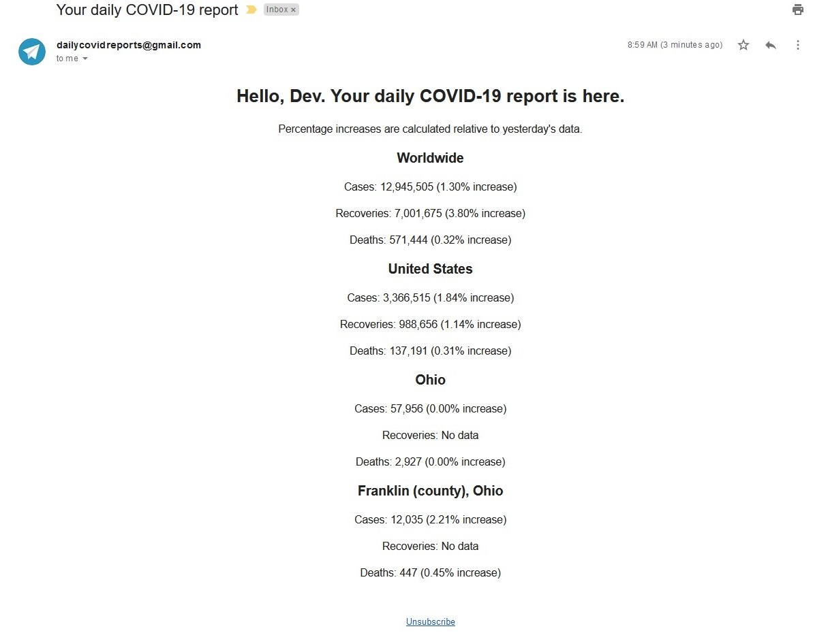

# [COVID-19 Web Scraper](http://covid19reports.epizy.com/) :email:
An automated web scraper that sends you daily COVID-19 data report emails.  

***The code for the sign-up website can be found [here](https://github.com/dvptl68/covid-scraper-website).***

## How to sign up:
Visit [this website](http://covid19reports.epizy.com/) to sign up to receive daily COVID-19 data report emails. You will be asked to select a country and enter your name and email. If you select the United States, you may also (optionally) select a state and county.  
  
If you register twice with different selections and the same email you will receive multiple emails for each selection. If you register twice with the same sleections and same emails *you will still receive multiple emails*.  
  
Every email has an unsubscribe link at the bottom, so you can opt-out of every location you register to receive emails for.

***Note: Due to Wikipedia constantly changing the HTML format of its data tables, the web scraper has to be maintained periodically. Currently, the data table for Florida is causing issues, and no emails will be sent until the issue is resolved.***

## How it works:

*All project dependencies can be viewed in depth with the [dependency graph](https://github.com/dvptl68/covid-scraper/network/dependencies).*

Wikipedia is used for the web scraper to get COVID-19 data. It scrapes Wikipedia data table template pages, including the [worldwide data table](https://en.wikipedia.org/wiki/Template:COVID-19_pandemic_data), the [U.S. state data table](https://en.wikipedia.org/wiki/Template:COVID-19_pandemic_data/United_States_medical_cases_by_state), and a data table for every state in the U.S.
  
I quickly found that getting COVID-19 data for each state would be a challenge, due to the inconsistencies between every data table. Take [Utah's data table](https://en.wikipedia.org/wiki/Template:COVID-19_pandemic_data/Utah_medical_cases_by_county) for example. If you compare that with [Ohio's data table](https://en.wikipedia.org/wiki/Template:COVID-19_pandemic_data/Ohio_medical_cases_by_county), it is easy to see the differences. Most state data tables also listed cases, recoveries, and deaths in different orders, so I had to account for that as well. Since it was inefficient to create 50 different Python functions for each state, there ended up being a lot of conditional statements to avoid errors.

This web scraper is very structured in terms of functions. First, the program reads different files to get all country, state, and county names. Then, it calls a function that scrapes the Wikipedia pages to get all COVID-19 data. After receiving the data, it is written to a JSON file. Then, it processes new users who have signed up to receive emails, and removes those who has opted out. Finally, it creates an HTML email specific to each user and sends it.

One of the most difficult parts of this project was getting user sign up and opt out data from the website to the script. The website is hosted through [InfinityFree](https://infinityfree.net/), which generously allows free PHP website hosting. However, with free cloud services, comes quite a bit of restrictions. While the domain included a free MySQL database, it was inaccessible from outside the website. I also tried hosting a MySQL database through [Microsoft Azure](https://azure.microsoft.com), but InfinityFree did not have the required database drivers.  

I needed a way to get the data out of the domain, so I turned to email. InfinityFree did allow email sending from the website, so every time a user signs up or opts out, an email is sent and the script parses the email to determine what actions to take. The script is hosted through [Python Anywhere](https://www.pythonanywhere.com/). Their free plan offers one daily script execution plus a MySQL database, which is precisely what I needed for my purposes.

## Contribute:
There may be bugs that I missed, so if you find a bug, you can create an issue or fork this repository, fix the bug, and create a pull request!
